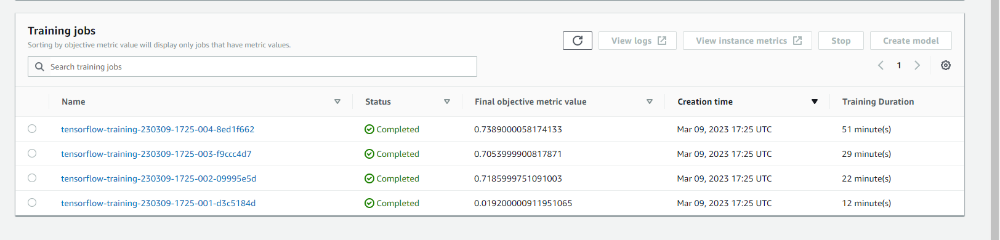
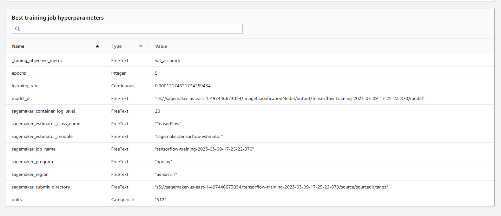
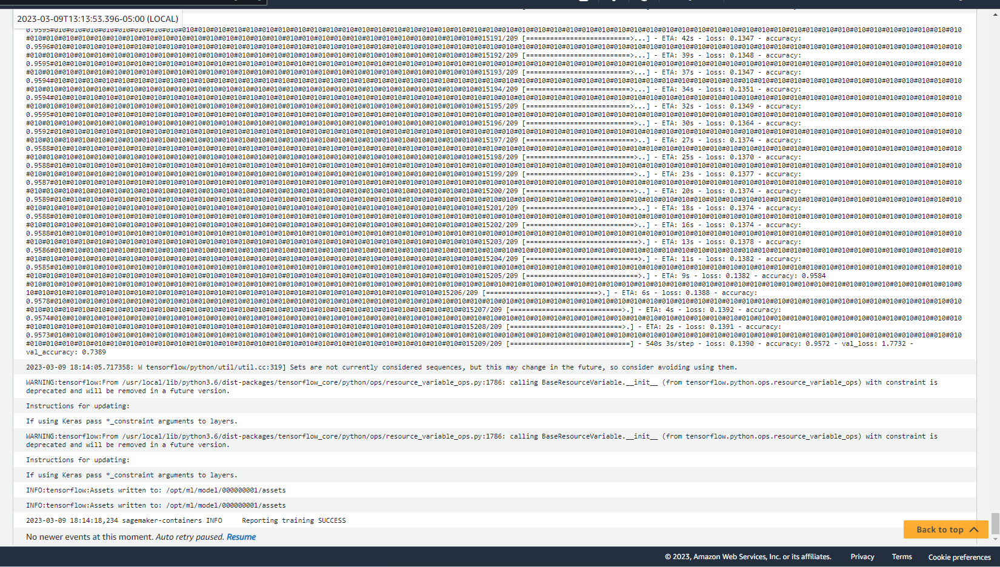
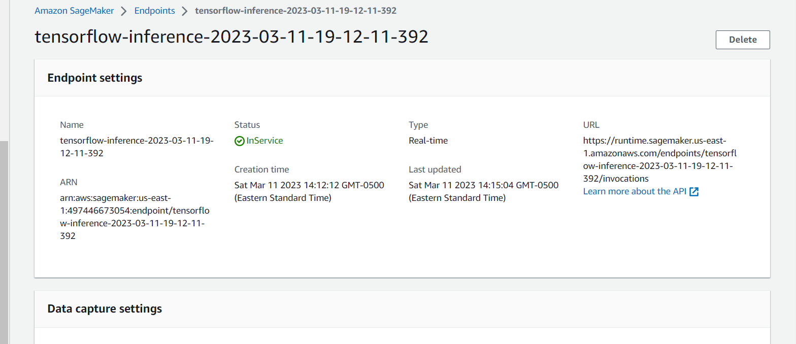

# Image Classification using AWS SageMaker

AWS Sagemaker provides a powerful cloud-based platform for creating and deploying machine learning models at scale. By leveraging the Inception V3 pre-trained model, hyperparameter tuner, profiler, and debugger, you can easily create a high-performing dog breed image classification model. The hyperparameter tuner automatically optimizes the model's hyperparameters, the profiler identifies and optimizes time-consuming parts of the training process, and the debugger helps to identify and fix any issues that may arise during training. With these tools, you can streamline the process of creating and deploying an accurate and efficient dog breed image classification model.

## Project Set Up and Installation

Create an AWS Sagemaker instance. Choose an appropriate instance size based on your needs and budget. Collect and prepare a dataset of images that contain different breeds of dogs or you can choose Dataset of your own. Upload the dataset to an S3 bucket on AWS and Import and install necessary libraries of our Project. 

## Dataset

The Dog breed dataset is a collection of images of dogs belonging to **133** different breeds. The Dataset has **6680** images of dogs of different breeds in train split, **836** images in test split and **835** images in valid split. 

Size of Images - **172800**  
Shape of the Image - **(240, 240, 3)**

The Dataset has 133 class distribution. Here is the top 10 breeds with many images of 

**Alaskan_malamute**: 77   
**Border_collie**: 74    
**Basset_hound**: 73  
**Dalmatian**: 71   
**Bullmastiff**: 69  
**Bull_terrier**: 69   
**Basenji**: 69  
**Cavalier_king_charles_spaniel**: 67  
**Irish_terrier**: 66  
**Australian_cattle_dog**: 66

### Access

Upload the data to an S3 bucket through the AWS Gateway so that SageMaker has access to the data. 

## Hyperparameter Tuning

Hyperparameter tuning is an essential process in machine learning to optimize the performance of a model. AWS Sagemaker provides a built-in hyperparameter tuning capability that can be used to automatically search for the best combination of hyperparameters for a given model. In this case, the Inception V3 model is being used for dog breed image classification, and the hyperparameter tuning job will search for the optimal values for the learning rate, units, and epochs hyperparameters.

Here, the learning rate is a continuous parameter that ranges from 0.0001 to 0.1 and uses a logarithmic scaling type, while the units parameter is a categorical parameter that can take values of either 256, 512, or 1024. The epochs parameter is an integer parameter that ranges from 1 to 6.

During the hyperparameter tuning job, AWS Sagemaker will randomly sample combinations of hyperparameters from the search space and train a new model for each combination. It will then evaluate the performance of each model using a validation dataset and select the combination of hyperparameters that produces the best results. This process is repeated until a satisfactory set of hyperparameters is found.

By using hyperparameter tuning, the Inception V3 model for dog breed image classification can be fine-tuned to achieve the best possible accuracy and performance on the given dataset.

## Debugging and Profiling

To effectively monitor and debug a dog breed image classification project using AWS Sagemaker, you can set up rules and hooks to identify potential issues such as overfitting, overtraining, poor weight initialization, loss not decreasing, and low GPU utilization.

To begin, you can include these parameters in the estimator for the training job, which will ensure that these rules and hooks are applied during the training process. In the train_model.py script, you can import the SMDebug framework class and pass the hook to the train and test functions. You can also set the hook for the training and evaluation phases to ensure that data is captured and analyzed at each stage.

Finally, you can register hooks to save output tensors, which will allow you to further analyze and debug any issues that are detected during the training process. By following these steps, you can effectively monitor and debug your dog breed image classification project using AWS Sagemaker and ensure that it is optimized for accuracy and performance.

### Results

Profiler Report is included in the folder under the ProfilerReport. 

## Model Deployment

After training and evaluating the dog breed image classification model using AWS Sagemaker, the next step is to deploy the model as an endpoint to be used for real-time inference.

To deploy the model, you can create an endpoint configuration that includes the trained model, the instance type, and the number of instances to be used for inference. You can then deploy the endpoint configuration to create the endpoint.

